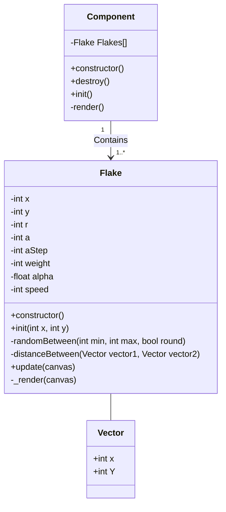

## Snowy Fiori

The original idea for this plugin came from [Meli Lauber](https://blogs.sap.com/2019/11/26/surprise-your-users-with-a-true-x-mas-user-experience-let-it-snow).

I just added some CSS tweaks.

A point for improvement is the performance. Everything is calculated on the CPU now. Ideally, the calculations would be done on the GPU instead.

# Class Diagram

# Preview

